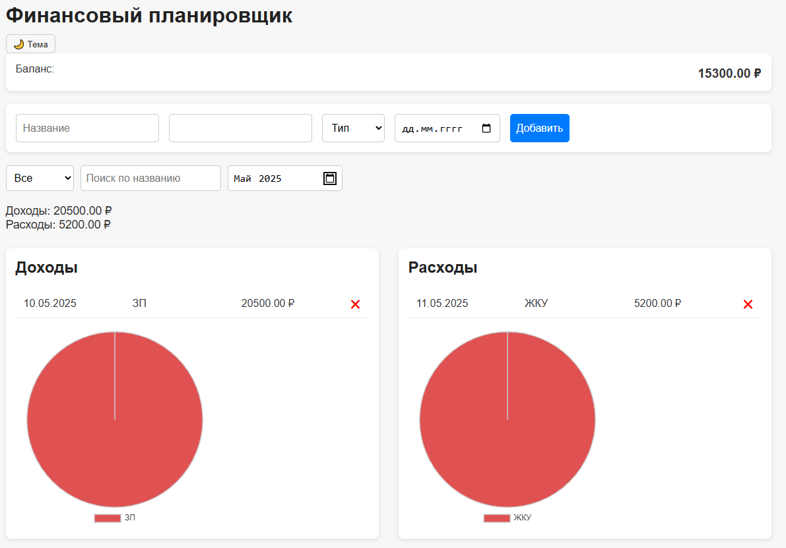

# Финансовый планировщик

Простой и удобный **финансовый планировщик**, созданный с использованием **HTML**, **CSS** и **Vanilla JavaScript**. Позволяет вести учет доходов и расходов, анализировать финансы с помощью фильтров и диаграмм, а также сохраняет данные в **localStorage**.

## Оглавление

- [Функциональность](#функциональность)
- [Структура проекта](#структура-проекта)
- [Как запустить](#как-запустить)
- [Скриншоты](#скриншоты)
- [Автор](#автор)

## Функциональность

- Добавление доходов и расходов с указанием суммы, даты и названия.
- Автоматический расчет:
  - Общего баланса
  - Суммарных доходов и расходов
- Визуализация данных с помощью **диаграмм** (Chart.js).
- Фильтрация по типу, названию и дате.
- Группировка мелких статей в "Другие" для наглядности.
- Темная и светлая тема с сохранением предпочтения.
- Удаление отдельных транзакций и полная очистка истории.
- Сохранение данных в **localStorage**.

## Структура проекта

- screens - Папка со скриншотами
- index.html - Основная HTML-страница
- style.css - Стилизация калькулятора
- script.js - Логика и обработка ввода
- README.md - Документация проекта

## Как запустить

1. Скачайте или клонируйте репозиторий:

   ```
   git clone https://github.com/Ars2805/financial-planner.git
   ```

2. Откройте файл index.html в браузере.

## Скриншоты





## Автор

- [Арсения Лушина](https://github.com/Ars2805)